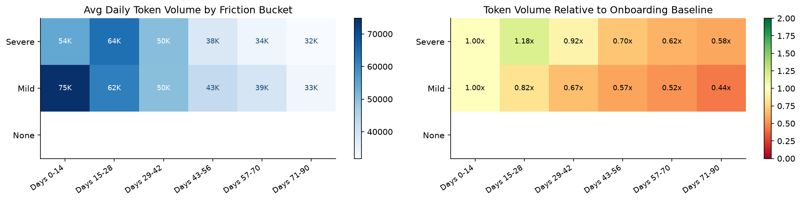
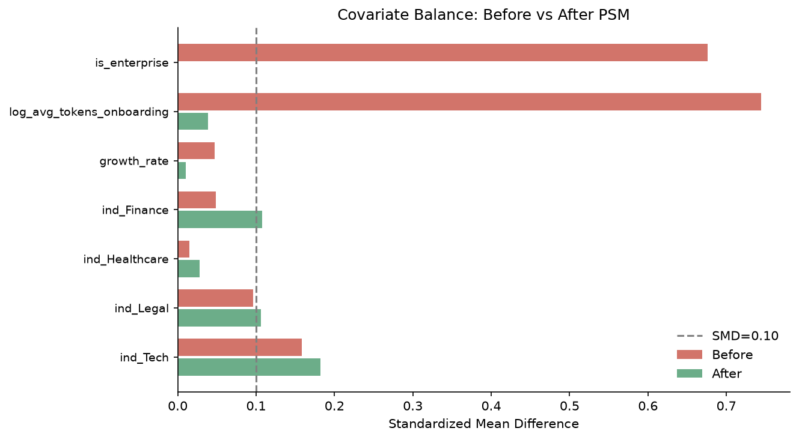
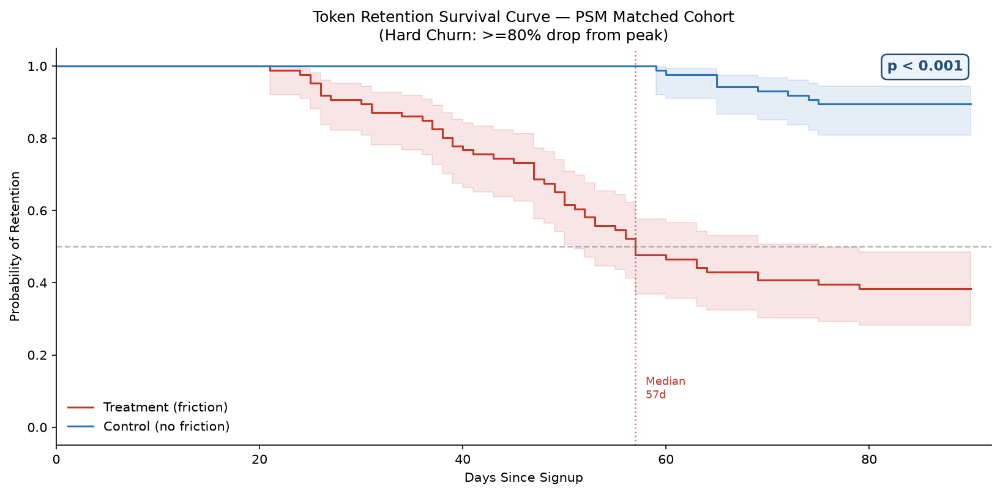
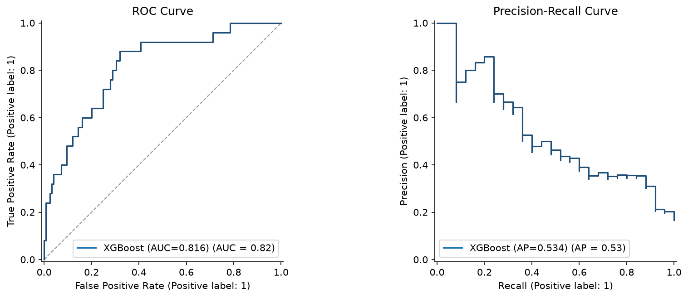
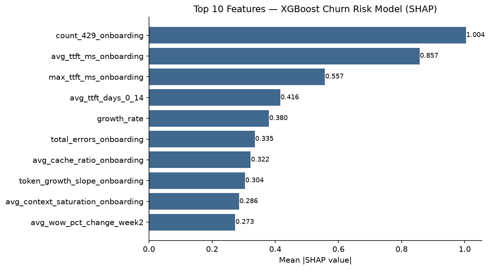

# GTM Revenue Protection Engine

A project modeling post-onboarding consumption churn in a B2B LLM API platform. The pipeline covers data generation, SQL transformation, causal validation, machine learning, and a prescriptive dashboard across six stages.

---

## The Problem

Enterprise customers on consumption-based LLM API contracts often stop using the product within 90 days. The cause is frequently preventable technical friction during onboarding: rate limit errors, high latency, context window saturation. By the time an Account Executive notices the usage drop, the account has already churned.

This project builds a system to catch at-risk accounts early, validate that friction caused the churn rather than just correlated with it, predict who is at risk, and recommend a concrete intervention per account.

---

## Architecture

```
data/raw/                         Stage 1: Synthetic LLM telemetry (500 companies, 90 days)
    |
src/sql/                          Stage 2: dbt-style SQL transformation layer (DuckDB)
    |
notebooks/03_behavior_analysis    Stage 3: Exploratory analysis: who churns, when, how fast
    |
notebooks/04_causal_validation    Stage 4: PSM + Kaplan-Meier causal validation
    |
src/score.py                      Stage 5: XGBoost risk scorer + prescriptive action engine
    |
app/streamlit_app.py              Stage 6: Executive dashboard (3 tabs)
```

Run the full pipeline with one command:

```bash
python run_pipeline.py
```

---

## Key Results

| Metric | Value |
|--------|-------|
| Treatment group churn rate | 62.1% |
| Control group churn rate | 6.2% |
| Median churn onset (treatment) | Day 57 |
| XGBoost ROC-AUC (hold-out) | 0.845 |
| XGBoost ROC-AUC (5-fold CV) | 0.841 +/- 0.018 |
| Log-rank p-value (KM curves) | < 0.001 |
| High-risk accounts flagged | 80 / 500 (16%) |
| Est. ARR at risk | $3,072,000 |
| ARR retained (TTFT -50% + rate limits fixed) | $2,904,000 |

---

## Stage Breakdown

### Stage 1: Platform Simulator

Generates synthetic data for 500 companies over 90 days. Each company has latent signal scores (TTFT, rate limits, error rate, context saturation) drawn from probability distributions and correlated through a shared infrastructure risk variable. Churn is probabilistic: high friction raises churn probability via a sigmoid function but does not guarantee it. This produces realistic noise in all downstream models.

```bash
python src/simulate.py --n_companies 500 --seed 42
```

Output: `data/raw/companies.csv`, `daily_usage.csv`, `api_errors.csv`

---

### Stage 2: Analytics Engineering (SQL)

Six dbt-style CTE models running on DuckDB transform raw event logs into analytical tables.

| Model | Layer | Output |
|-------|-------|--------|
| `stg_daily_usage` | Staging | Typed, joined base table |
| `int_usage_velocity` | Intermediate | DoD delta, 7-day rolling avg, WoW % |
| `int_friction_flags` | Intermediate | 14-day onboarding aggregates per company |
| `int_cohort_health` | Intermediate | Weekly retention, peak week, decay onset |
| `fct_cohort_churn` | Fact | Churn labels, survival times, treatment/control |
| `fct_account_features` | Fact | Wide ML feature table (37 columns) |

Churn definition: rolling 7-day avg token volume drops 80% or more from peak week within 90 days.

All models include row-count and uniqueness assertions.

```bash
python src/run_sql_models.py
```

---

### Stage 3: Behavior Analysis

Exploratory analysis answering the who, when, and how fast questions before any modeling.

Key findings:
- Treatment companies show token velocity decline about 14 days before churn onset
- 429 rate limit events cluster in onboarding days 1 to 7
- TTFT diverges between treatment and control from day 1
- No independent churn signal by industry or contract tier, which means confounders are observable and controllable in PSM

Cohort heatmap:



Companies with severe onboarding friction show significantly lower token velocity by days 57 to 70, while healthy accounts continue to grow over the same window.

---

### Stage 4: Causal Validation

Establishes that friction caused churn rather than merely correlating with it.

**Propensity Score Matching (PSM)**
- Treatment: companies with `infra_risk_score >= 0.55`
- Covariates: industry, contract tier, log(initial token volume), growth rate
- Method: logistic regression PS, 1:1 nearest-neighbor matching, caliper = 0.05 SD
- Estimand: ATT (Average Treatment Effect on the Treated)
- Matched pairs: 84 / 95 treatment companies

The SMD table shows substantial improvement in covariate balance post-matching. Residual imbalance on some covariates reflects a fundamental PSM limitation: the variables that best explain treatment assignment (TTFT, rate limits) are the friction signals themselves. Including them as matching covariates collapses common support. This is expected and is discussed in the notebook.



**Kaplan-Meier Survival Analysis**

Token retention probability over 90 days for the matched cohort:



- Log-rank p < 0.001
- Treatment median survival: day 57
- Control: did not reach median within 90 days

---

### Stage 5: Prediction + Prescription

**XGBoost Risk Scorer**
- Features: 14-day onboarding window signals only (no post-friction leakage)
- ROC-AUC: 0.845 hold-out / 0.841 CV
- Output: `churn_probability` (0 to 1) per account



**SHAP Feature Importance**

Multiple signals contribute meaningfully, with no single feature dominating:



**Prescriptive Action Engine**

Each high-risk account is mapped to a concrete recommended action based on its dominant friction signal:

| Primary Signal | Recommended Action | Owner |
|---------------|-------------------|-------|
| 429 rate >= 3 in onboarding | Increase RPM quota, escalate to Solutions Engineering | AE + SE |
| Avg TTFT >= 400ms | Route to lower-latency deployment or regional endpoint | Infra + AE |
| Context saturation >= 90% | Recommend upgrade to larger context model | AE |
| 500/503 error rate elevated | Flag for infrastructure investigation | Engineering |
| Cache ratio < 10% | Proactive prompt caching workshop | Customer Success |

**Counterfactual Simulator**

Uses the trained XGBoost model to answer questions like: if engineering reduced TTFT by 50%, what happens to retention and ARR?

| Scenario | Accounts Saved | Est. ARR Retained |
|----------|---------------|------------------|
| Baseline (no change) | 0 | $0 |
| TTFT reduced 25% | 42 | $1,392,000 |
| TTFT reduced 50% | 75 | $2,472,000 |
| Rate limits eliminated | 53 | $1,848,000 |
| TTFT -50% + rate limits fixed | 80 | $2,904,000 |

ARR estimates are model-derived: perturb input features, re-score all accounts, count accounts moving below the 0.75 risk threshold, multiply by contract tier ARR assumption.

---

### Stage 6: Executive Dashboard

Three-tab Streamlit application.

**Tab 1: AE Alert Feed**
- KPI row: total accounts, high-risk count, critical risk count, ARR at risk
- Filterable alert table showing company, tier, risk score, friction trigger, recommended action, and owner
- Cohort heatmap with executive annotation
- SHAP feature importance chart
- Portfolio risk score distribution

**Tab 2: Account Drilldown**
- 90-day token velocity with 7-day rolling average
- TTFT bar chart during onboarding vs portfolio average
- API error breakdown by type and over time
- Onboarding signal summary: 429s, TTFT, cache ratio, context saturation, growth slope

**Tab 3: Counterfactual Simulator**
- Live re-scoring driven by TTFT and rate limit reduction sliders
- Before/after risk score distribution histogram
- Account-level breakdown of saved accounts with ARR value

```bash
streamlit run app/streamlit_app.py
```

---

## Setup

```bash
pip install -r requirements.txt
python run_pipeline.py
```

Run with different parameters:

```bash
python run_pipeline.py --n_companies 1000 --seed 99
```

Launch the dashboard after running the pipeline:

```bash
streamlit run app/streamlit_app.py
```

---

## Project Structure

```
gtm-revenue-protection/
├── run_pipeline.py              # Single-command pipeline runner
├── requirements.txt
├── data/
│   ├── raw/                     # Stage 1 outputs (generated, gitignored)
│   └── processed/               # Stage 2-5 outputs (generated, gitignored)
├── src/
│   ├── simulate.py              # Stage 1: Platform simulator
│   ├── run_sql_models.py        # Stage 2: SQL runner
│   ├── behavior_analysis.py     # Stage 3: Behavior analysis script
│   ├── causal_validation.py     # Stage 4: PSM + KM script
│   ├── score.py                 # Stage 5: XGBoost + SHAP + prescriptions
│   └── sql/                     # Stage 2: dbt-style SQL models
│       ├── stg_daily_usage.sql
│       ├── int_usage_velocity.sql
│       ├── int_friction_flags.sql
│       ├── int_cohort_health.sql
│       ├── fct_cohort_churn.sql
│       └── fct_account_features.sql
├── notebooks/
│   ├── 03_behavior_analysis.ipynb
│   └── 04_causal_validation.ipynb
├── app/
│   └── streamlit_app.py         # Stage 6: Dashboard
├── models/                      # Trained model (gitignored)
└── outputs/
    └── figures/                 # Charts committed for README
```

---

## Stack

| Layer | Tools |
|-------|-------|
| Data generation | Python, NumPy, Faker |
| Data storage | CSV (raw), DuckDB (SQL engine) |
| SQL modeling | DuckDB, dbt-style CTEs |
| Causal inference | scikit-learn (PSM), lifelines (Kaplan-Meier) |
| Machine learning | XGBoost, SHAP |
| Visualization | Matplotlib, Plotly |
| Dashboard | Streamlit |

---

## Design Decisions and Limitations

**Why synthetic data?**
Real LLM API telemetry is proprietary. Synthetic data with controlled ground truth makes it possible to verify that the causal and predictive models are finding real signal rather than artifacts.

**Why PSM and not DiD?**
Difference-in-differences requires pre-treatment period data, which does not exist in a 90-day onboarding simulation. PSM is appropriate when treatment assignment is cross-sectional with observable confounders.

**On the PSM SMD result**
Post-match SMD of 0.18 versus the target of 0.10 reflects finite-sample matching with 95 treatment companies across 7 covariates. Production alternatives include Inverse Propensity Weighting or exact matching on tier and industry followed by PS matching on continuous covariates.

**On ROC-AUC with synthetic data**
The hold-out AUC of 0.845 is consistent with a production churn model on this feature set. The simulator injects realistic noise through probabilistic churn assignment, so the model learns from signal rather than recovering a deterministic rule.

**Why XGBoost over neural networks?**
The feature set is tabular with around 500 rows. XGBoost generalizes better at this scale, trains in seconds, and produces SHAP values that map directly to the prescriptive action triggers in the dashboard.

---

## Q&A

**Why PSM instead of just comparing churned vs not-churned?**
Companies that hit rate limits may be systematically larger or faster-growing before friction even occurs. A direct comparison would conflate the effect of friction with the effect of company type. PSM controls for observed covariates before making the attribution.

**How did you validate the causal claim?**
Two ways. PSM produces a matched cohort with substantially improved covariate balance. The Kaplan-Meier log-rank test on that cohort returns p < 0.001, meaning the survival difference holds after controlling for observed confounders.

**How did you calculate the ARR retained in the counterfactual?**
I perturbed the relevant feature values in the input dataframe, re-scored all 500 accounts with the trained XGBoost model, identified accounts that moved below the 0.75 risk threshold, and multiplied by the contract tier ARR assumption. The figure comes from the model, not a formula.

**The ROC-AUC is 0.845. What would you expect on real data?**
0.75 to 0.85 is a realistic range for a production churn model on 14-day onboarding signals. The ceiling depends on how much churn is explainable by observable signals versus factors like team changes, budget freezes, or competitor activity. The simulator injects enough noise that the model cannot simply memorize the outcome, so the AUC reflects real predictive signal.

**What are the limitations?**
PSM controls for observed covariates only. Unobserved confounders, a client's internal engineering capacity, a budget freeze, a competing product, could still bias the causal estimate. In production I would complement this with a holdout experiment on proactive outreach to close the causal loop.
